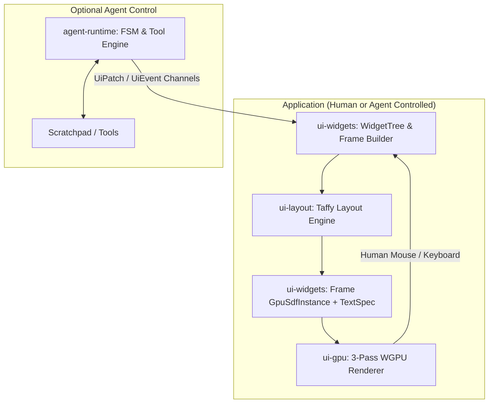

# AORUI (An Other Rust UI)

[](https://www.rust-lang.org/)
[](https://wgpu.rs/)
[](#license)

**AORUI** (*An Other Rust UI*) is a generalist, high-performance desktop UI toolkit and rendering engine written in Rust. It combines a state-of-the-art **cyber-glass aesthetic** (analytic GPU Signed Distance Field quads + real-time Dual-Kawase backdrop blur) with an ergonomic, declarative widget tree and flexbox/grid layout system.

AORUI is designed **for humans first**, with an **optional AI Agent runtime** (`agent-runtime`) that can interact with the UI through the exact same canonical event system (`UiEvent`) as a human user.

---

## Key Features

- **⚡ Cyber-Glass GPU Rendering Engine (`ui-gpu`)**:
  - Multi-pass hardware pipeline built on top of `wgpu 0.19`.
  - Analytic SDF shader rendering with continuous corner radii, subtle borders, and dynamic interactive glow effects.
  - Real-time Dual-Kawase downsample/upsample background blur for true glassmorphism.
  - High-performance text rendering with subpixel positioning via `glyphon` / `cosmic-text`.

- **📐 Flexbox & Grid Layout (`ui-layout`)**:
  - High-speed flexbox and CSS Grid computation powered by `taffy`.
  - Screen-space absolute coordinate resolution and viewport clipping.

- **🎨 Comprehensive Component Library (`ui-widgets`)**:
  - **Tool Palettes**: Floating Photoshop/Blender style sub-windows with draggable title bars, fold/collapse toggle (`▲`/`▼`), close action (`✕`), and corner resize grips (`⇲`).
  - **Color Picker**: Pro 2D Saturation/Value canvas with Hue rainbow slider, swatch bar, and real-time conversion across **HEX**, **RGB**, **CMYK**, and **CIELAB** color spaces.
  - **Windows & Overlays**: Frameless OS windows with manual edge/corner resizing, draggable modal dialogs with backdrop blur, dropdown menus, context menus, and toast notifications.
  - **Navigation**: Horizontal menubars, segmented control pills, tab bars, breadcrumb paths, and pagination controls.
  - **Data Display**: Multi-column sortable data tables, collapsible tree views with expand/collapse arrows, rich status lists with color-coded badges, and metric cards with trend indicators.
  - **Inputs & Controls**: Buttons, icon buttons, toggle switches, checkboxes, radio groups, single-line text inputs, multiline text areas, password inputs with show/hide toggle, and numeric stepper inputs.
  - **Splits & Scrolling**: Resizable horizontal/vertical split views and 2D scroll views with proportional scrollbars.

- **🤖 Optional Agent Driver (`agent-runtime`)**:
  - Strict Finite State Machine (FSM), typed schema validation, execution budgets, and mandatory tool timeouts.
  - Completely decoupled: the UI engine never depends on the agent runtime.

---

## Architecture Overview



### Crates Breakdown

| Crate | Description |
|---|---|
| [`crates/ui-core`](crates/ui-core) | Foundational types, `GpuSdfInstance` bit-for-bit memory layouts, and canonical `UiEvent`/`UiPatch` event protocols. |
| [`crates/ui-layout`](crates/ui-layout) | Taffy integration providing flexbox, grid, and screen-space hit testing. |
| [`crates/ui-widgets`](crates/ui-widgets) | Declarative widget definitions, Cyber-Glass theme system, and frame generators. |
| [`crates/ui-gpu`](crates/ui-gpu) | Hardware rendering pipeline (Dual-Kawase blur, SDF card shader, Glyphon text layer). |
| [`crates/agent-runtime`](crates/agent-runtime) | Optional agent execution runtime with strict state transitions and tool sandboxing. |

---

## Quick Start

### Prerequisites
- [Rust](https://rustup.rs/) (stable, 2021 edition)
- A GPU supporting Vulkan, DirectX 12, or Metal

### Running the Interactive Widget Gallery

Clone the repository and run the built-in gallery:

```bash
git clone https://github.com/lecyberbill/AORUI.git
cd AORUI
cargo run -p widget_gallery
```

### Basic Code Example

```rust
use ui_layout::{length, Size, Style};
use ui_widgets::{Theme, ToastKind, WidgetId, WidgetTree};

fn build_ui(tree: &mut WidgetTree) -> ui_layout::NodeId {
    let button = tree.button(
        WidgetId::new("action_btn"),
        "Deploy Shield",
        true,
        Style {
            size: Size { width: length(140.0), height: length(32.0) },
            ..Default::default()
        },
    ).unwrap();

    let toast = tree.toast(
        WidgetId::new("notification"),
        "Cluster Online",
        "All 42 nodes synchronized.",
        ToastKind::Success,
        Style {
            size: Size { width: length(300.0), height: length(60.0) },
            ..Default::default()
        },
    ).unwrap();

    tree.container(&[button, toast], Style::default()).unwrap()
}
```

---

## Running Tests

AORUI maintains a strict 100% pass rate across unit and integration tests:

```bash
cargo test --workspace
```

---

## Documentation

- **[Widget Catalog & API Guide](WIDGET_CATALOG.md)**: Full reference for all available widgets, styles, and events.
- **[Technical Report](TECHNICAL_REPORT.md)**: Deep dive into the mathematical axioms, GPU memory layouts, and security invariants.

---

## License

Dual-licensed under either:

- **MIT License** ([LICENSE-MIT](LICENSE-MIT) or [http://opensource.org/licenses/MIT](http://opensource.org/licenses/MIT))
- **Apache License, Version 2.0** ([LICENSE-APACHE](LICENSE-APACHE) or [http://www.apache.org/licenses/LICENSE-2.0](http://www.apache.org/licenses/LICENSE-2.0))

at your option.
