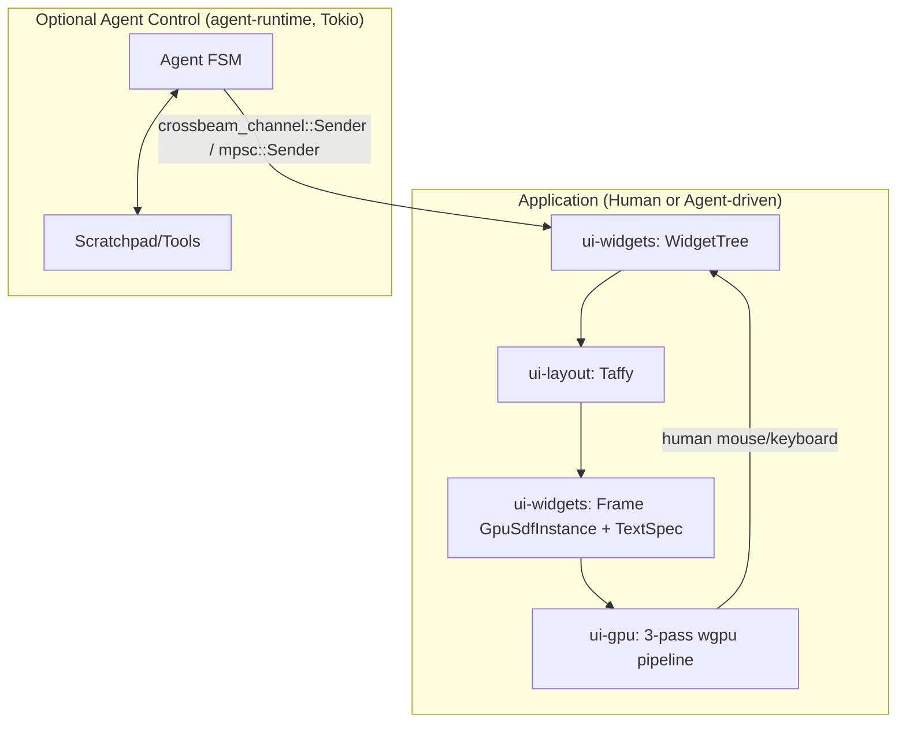
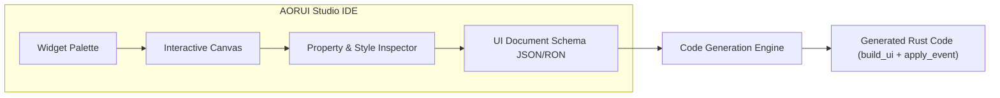

# TECHNICAL REPORT — AORUI (An Other Rust UI)

## Context & Core Axiom
**AORUI (An Other Rust UI) is a generalist, high-performance Rust UI library** with cyber-glass aesthetics (analytic GPU SDF quads + Dual-Kawase backdrop blur), designed for human desktop applications first. `agent-runtime` (FSM/Tool/budget/timeout) is preserved as an **optional** driver: it can interact with the UI using the exact same canonical event protocol (`UiEvent`) as a human mouse/keyboard pointer, but is not coupled to the UI architecture. Central Axiom: **the rendering engine (`ui-gpu`/`ui-layout`/`ui-widgets`) never depends on `agent-runtime`; the inverse (agent -> UI) is enabled cleanly via `ui-core`.**

## Stack & Topology
- **Current Topology:** DAG of crates — `ui-core` (root, generic event/patch protocol + `GpuSdfInstance`) ← `ui-layout` (generic Taffy layout) ← `ui-widgets` (buttons/labels/inputs/lists/checkboxes/window/tabs/scroll/menus/overlays) ← `ui-gpu` (WGPU 0.19 renderer) ← `examples/widget_gallery`. `agent-runtime` depends only on `ui-core` in parallel, without coupling to `ui-widgets`/`ui-gpu`.
- **Structural Invariants & Healthchecks:**
  - *INV-CORE-1 [Decoupling]:* `ui-core` must not depend on `wgpu`, `winit`, nor activate a `tokio` runtime. Healthcheck: `cargo tree -p ui-core -i` must never list `wgpu`/`winit`.
  - *INV-WIDGETS-1 [Renderer decoupling]:* `ui-widgets` must not depend on `wgpu`/`winit`/`glyphon`, nor on `agent-runtime`. It produces pure `GpuSdfInstance`/`TextSpec` data. Healthcheck: `cargo tree -p ui-widgets -i` must never list `wgpu`/`agent-runtime`.
  - *INV-GPU-1 [Memory layout]:* `GpuSdfInstance` (`#[repr(C)]`, `Pod`/`Zeroable`) must remain in exact bit-for-bit bijection with `sdf_card.wgsl`. Healthcheck: `cargo test -p ui-gpu` (size = 80 bytes + offline WGSL validation via `naga`).
  - *INV-GPU-2 [Scroll clipping]:* `ScrollView` clips contents (SDF via shader discard, text via `glyphon::TextBounds`), and hit-testing respects the visible rectangle (`EffectiveBounds`).
  - *INV-GPU-3 [Corner radius clamping]:* Corner radius is clamped to half the smaller side to prevent SDF math distortion.
  - *INV-LAYOUT-1 [Absolute bounds]:* `LayoutTree::resolved_bounds` / `hit_test` expose screen-space absolute coordinates. Healthcheck: `cargo test -p ui-layout`.
  - *INV-FSM-1 [Strict state transitions]:* Any agent state mutation must pass through `AgentState::can_transition_to`. Healthcheck: `cargo test -p agent-runtime`.
  - *INV-BUDGET-1 [Execution budget]:* `max_steps` bounds iterations. Healthcheck: `step_budget_is_enforced`.
  - *INV-TIMEOUT-1 [Mandatory tool timeout]:* Every `Tool::execute` is wrapped by `tokio::time::timeout`. Healthcheck: `tool_timeout_is_enforced_and_reported`.
  - *INV-BUILD-1 [Workspace compilation]:* `cargo check --workspace` must pass cleanly.

## Security (INV-SEC)
- *INV-SEC-1 [Trust boundary]:* `UiEvent`/`UiPatch` (`ui-core`) travel across in-process channels (`mpsc`, `crossbeam_channel`). If exposed over external IPC, source verification is mandatory before deserialization. Documented in [lib.rs](crates/ui-core/src/lib.rs).
- *INV-SEC-2 [No panic on content errors]:* The Render Thread (`ui-gpu`) must never panic on malformed text inputs — graceful degradation instead of crash.
- *INV-SEC-3 [Tool execution contract]:* `Agent::execute_tool` validates arguments against `Tool::schema()` ([schema.rs](crates/agent-runtime/src/schema.rs)) before execution and applies `tokio::time::timeout`.
- *INV-SEC-4 [Bounded scratchpad]:* `Agent::push_scratchpad` caps memory at `max_scratchpad_entries` (FIFO) to prevent unbounded growth.

## Verification Gate
- [x] INV-BUILD-1: SUCCESS (`cargo check --workspace`)
- [x] INV-CORE-1: SUCCESS (`ui-core` has zero GPU/windowing dependencies)
- [x] INV-LAYOUT-1: SUCCESS (`cargo test -p ui-layout` — 2/2 passed)
- [x] INV-GPU-1: SUCCESS (`cargo test -p ui-gpu` — 6/6 passed)
- [x] INV-GPU-2: SUCCESS (`ScrollView` clipping & hit-test verified)
- [x] INV-GPU-3: SUCCESS (`corner_radius` clamped to half side)
- [x] INV-SEC-1/2/3/4: SUCCESS (Schema validation, timeouts, non-panicking renderers)
- [x] INV-FSM-1, INV-BUDGET-1, INV-TIMEOUT-1: SUCCESS (`cargo test -p agent-runtime` — 10/10 passed)
- [x] INV-WIDGETS-1: SUCCESS (`cargo test -p ui-widgets` — 37/37 passed, including SplitView, TreeView, TextArea, PasswordInput, NumberInput, and Keyboard Tab focus navigation)
- [x] Total test suite: 55/55 tests passing across the entire workspace.

---

## Roadmap: AORUI Studio (Visual Designer & Code Generator)

### Vision & Feasibility
**AORUI is architecturally tailor-made for visual design and code generation** for four core reasons:
1. **Pure Declarative Tree:** Unlike object-oriented GUI toolkits with hidden runtime state, `WidgetTree` is an immutable, data-oriented graph of `WidgetKind` instances and Taffy `Style` rules.
2. **Deterministic Rust Code Generation:** Any visual layout constructed in the canvas translates directly into Rust builder calls (e.g. `tree.button(id, label, enabled, style)`).
3. **Structured Event Wiring:** Interactive widgets map 1:1 to canonical `UiEvent` variants (`ButtonClicked`, `CheckboxToggled`, `SelectChanged`, `MenuToggled`). The designer can automatically generate both the layout function and the `match event { ... }` event handling skeleton.
4. **Self-Hosting (Dogfooding):** AORUI's docking cards, resizable panes, menubars, and modal dialogs enable building the visual designer itself in Rust using AORUI.

### Proposed Architecture for AORUI Studio

### Roadmap Milestones
- [ ] **Phase 1: Serialized UI Schema (`aorui-schema`):** Define a lossless JSON/RON schema representing widget hierarchies, styles, constraints, and event bindings.
- [ ] **Phase 2: Code Generator (`aorui-codegen`):** Pure generator taking an `aorui-schema` tree and emitting idiomatic, formatted Rust code (`build_ui(&mut WidgetTree)` and event dispatcher boilerplate).
- [ ] **Phase 3: Visual Canvas & Drag-and-Drop Editor (`aorui-studio`):**
  - Component palette with live preview of cyber-glass widgets.
  - Interactive canvas supporting flexbox snapping, guidelines, and visual hierarchy tree.
  - Property Inspector for colors, padding, margins, flex directions, typography, and widget-specific props.
  - Event Bindings Inspector to define event actions and handler names.
- [ ] **Phase 4: Live Hot-Reloading:** Dynamic interpretation of UI schema during design time with instant compilation to native Rust on export.
